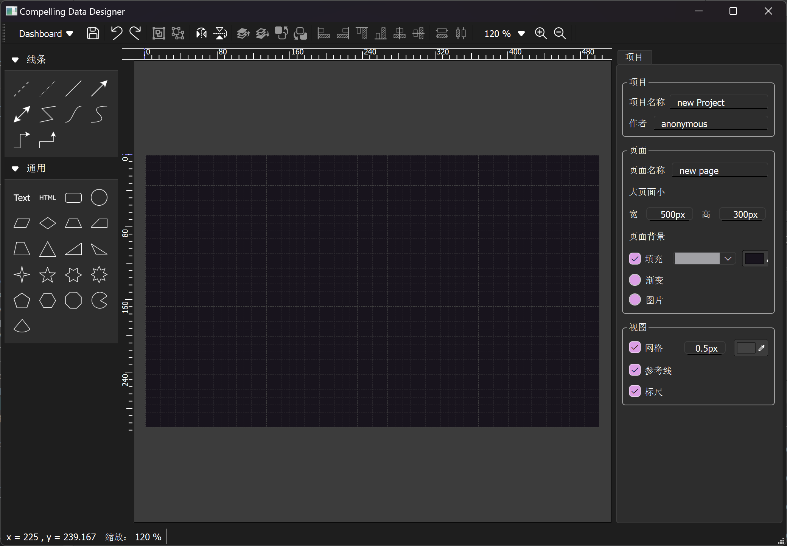
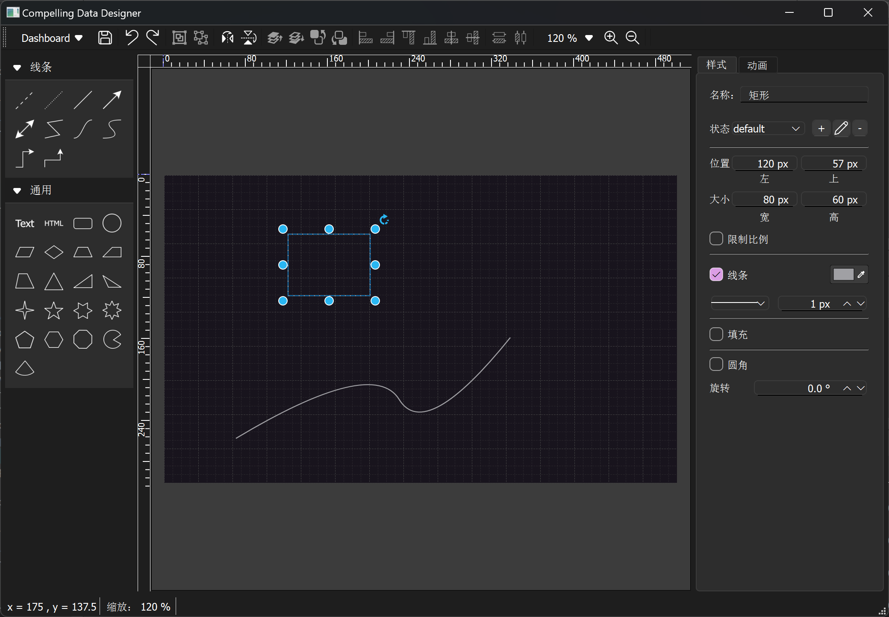
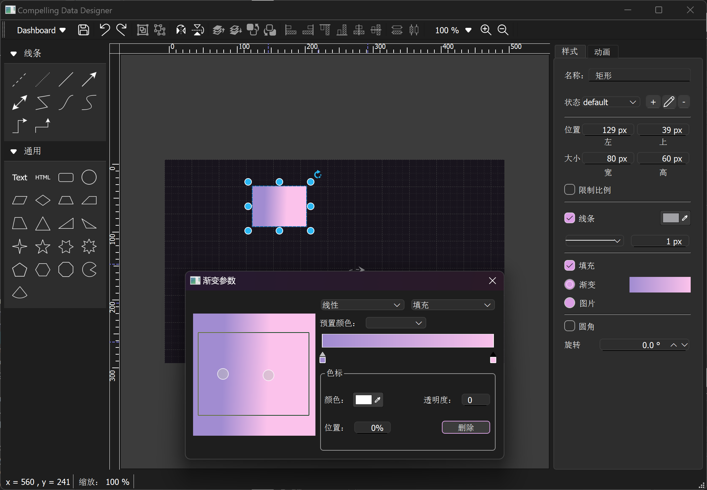
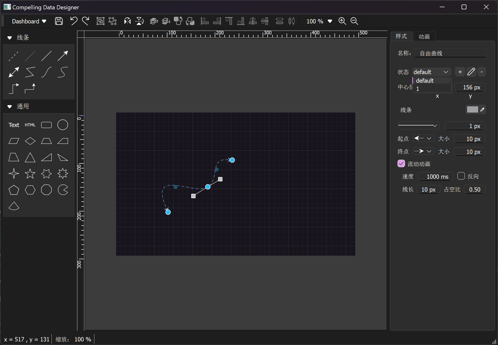
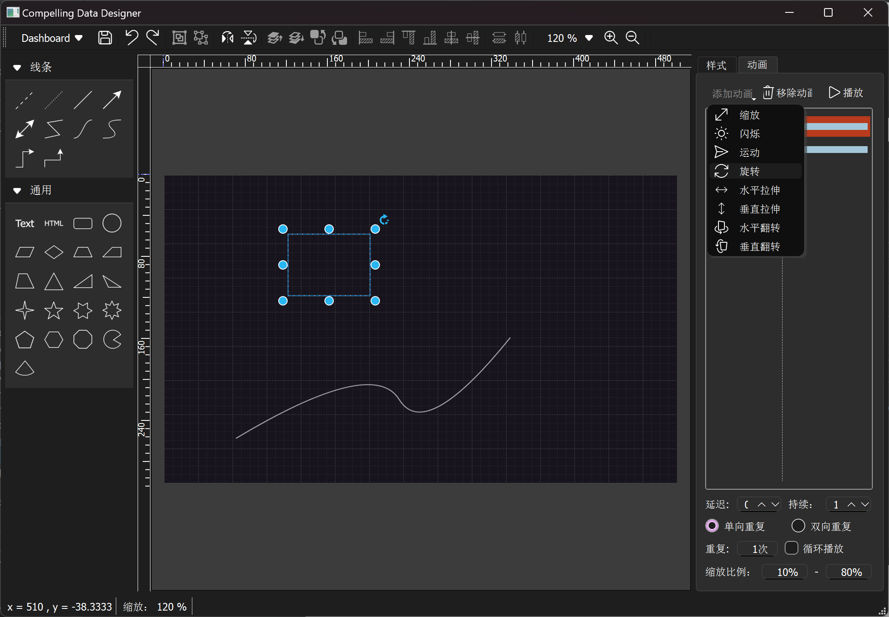
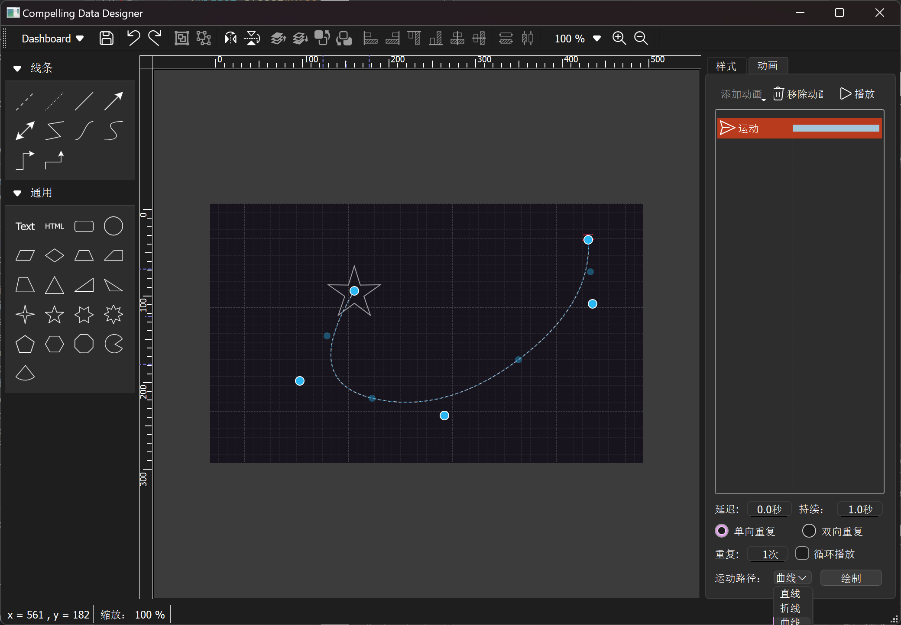
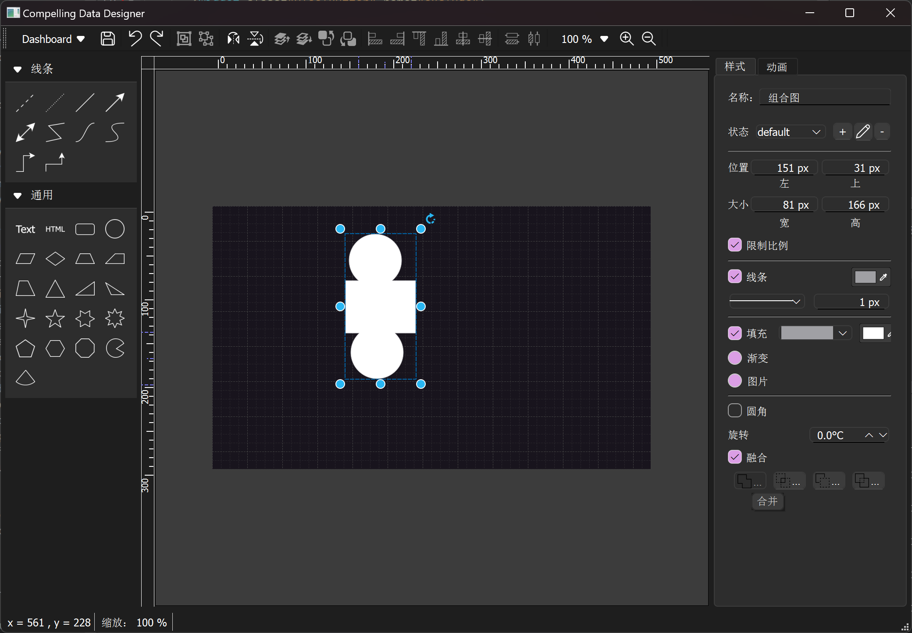

# Compelling Data Designer
Compelling Data Designer用于数据的可视化设计，支持HTTP RESTfull、数据库、TCP、UDP等多种数据接口协议，通过图表、动画等多种方式支持数据呈现。可满足工厂设备状态监控、生产线OEE效率看板、能源消耗动态分析、交通流量热力图、环境监测站PM2.5实时播报等各种数据可视化需求。软件采用可扩展架构，支持扩展图形插件、数据接口。目前已设计完成基本图形、多属性配置、动画等功能。
# features
- 低代码开发，灵活配置
- 插件式设计，可灵活添加图元插件、动画插件
- 支持图元多属性集配置，通过数据源可控制并选择图元属性集
- 支持图元动画，通过数据源可控制并选择图元当前播放的动画
- 支持多种数据接口
# environment
 - QT 6.8.1
 - C++ 11
# build 
1. 首先编译common模块
2. 其次编译BIWidgets模块生成插件，并将插件安装到\Qt\6.8.0\msvc2022_64\plugins\designer目录和\Qt\qtcreator-15.0.0\bin\plugins\designer目录
3. 编译plugins模块生成图元插件
4. 编译BIDesigner模块生成可执行程序
# Screenshots
1. 项目配置：可定义页面大小，页面填充样式。绘图区域根据配置及缩放大小自动调整标尺，并提供参考线用于图元对其。

    

2. 图元样式：可控制图元大小、线条样式、颜色，填充样式、颜色、渐变、背景图，圆角，旋转角度等

    

3. 线条图元：提供起点和终点箭头样式（该样式可通过SVG图片进行扩展），流动动画（可配置流动样式及播放速度）

    

4. 动画：提供缩放、闪烁、运动路径、旋转、水平拉伸、垂直拉伸、水平翻转、垂直翻转动画，所有图元（包括组合图元）支持动画。

  

5. 图元组合：所有图元均可组合，组合后可以通过合并、交集、差集、排除作为一个新图元继续配置属性集和动画

