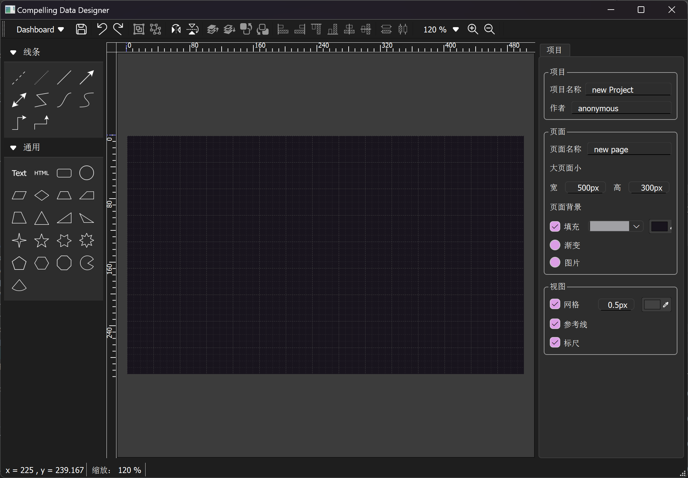
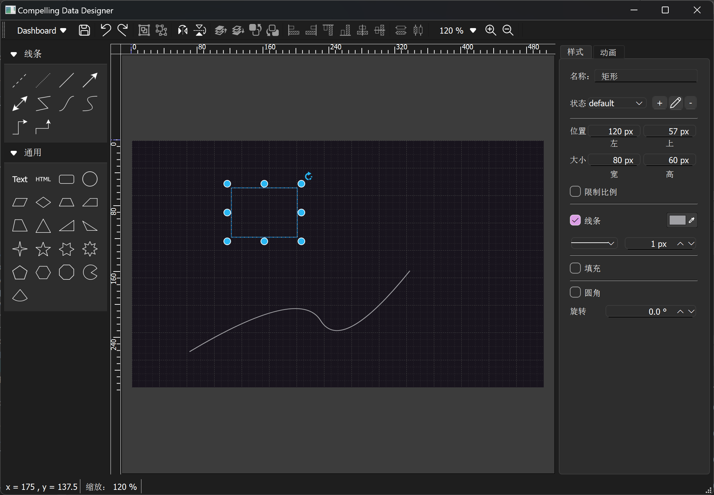
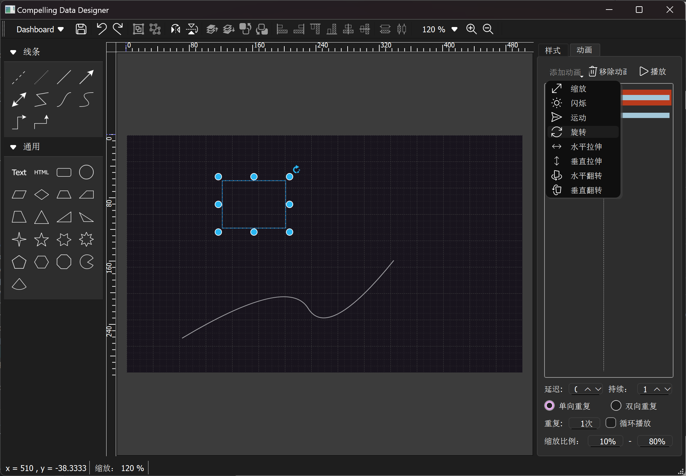
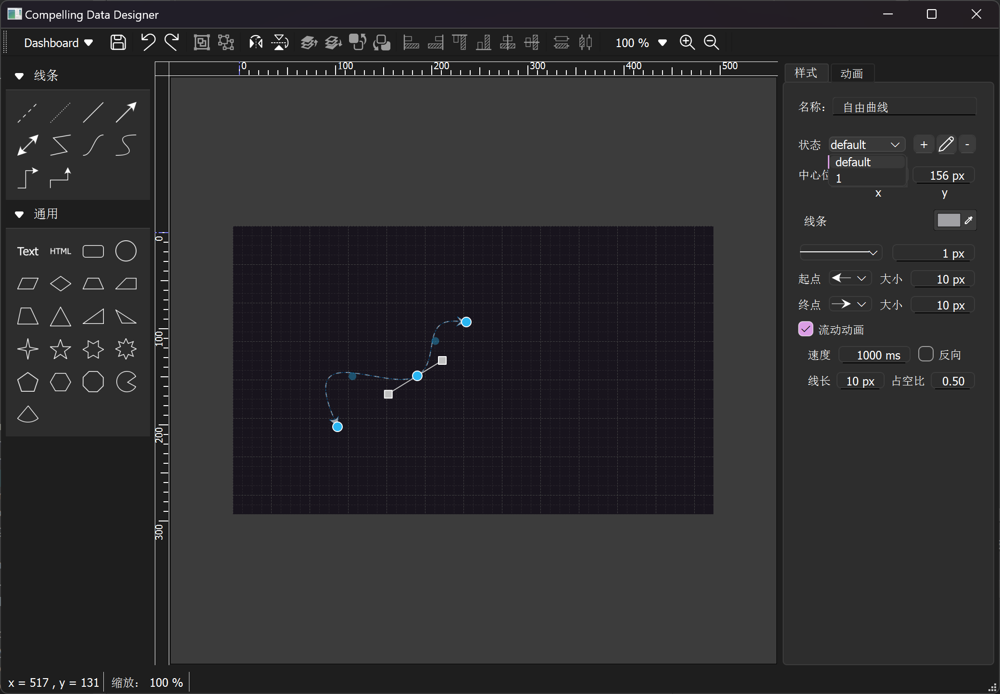
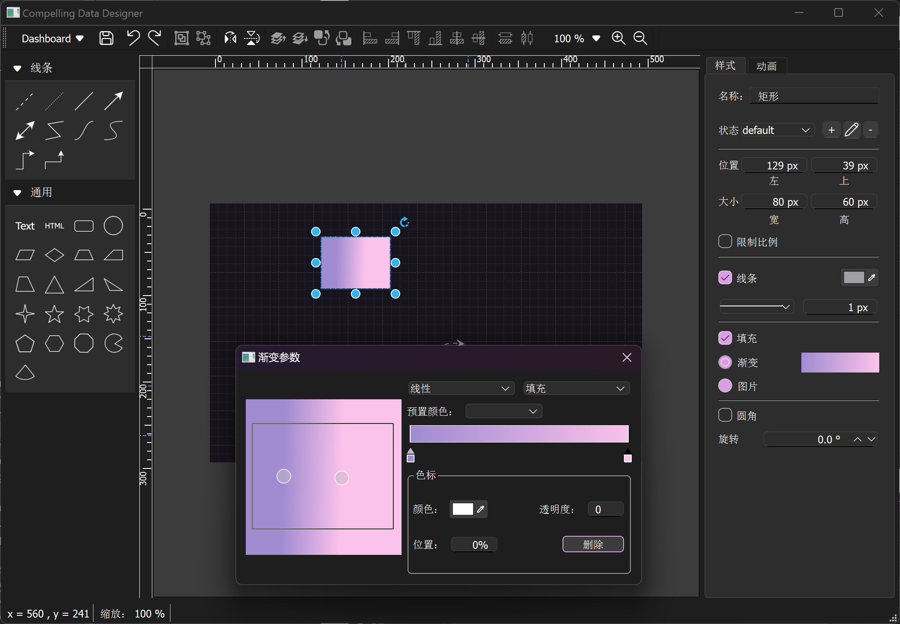
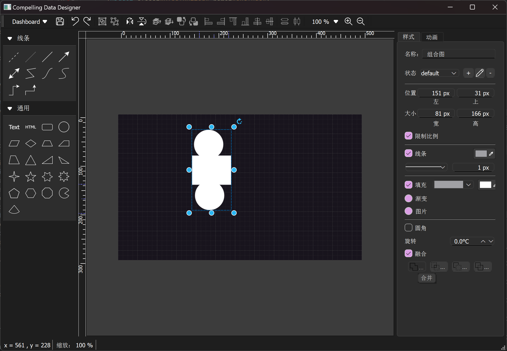
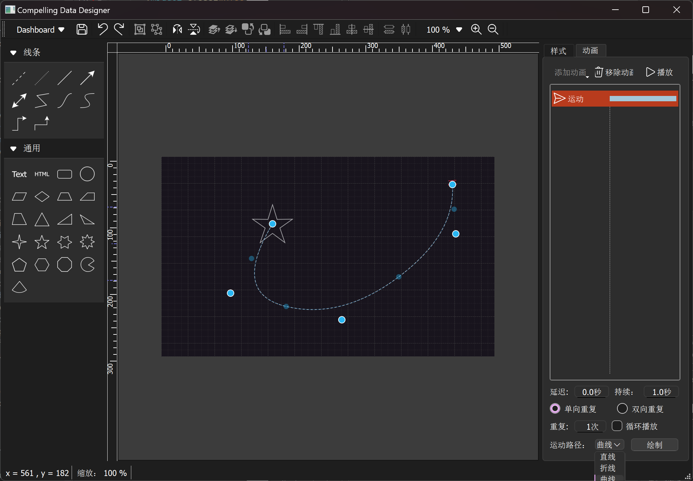

# Visual Data Studio - 可视化数据仪表盘设计器

[](LICENSE)
[](https://www.qt.io/)
[](https://isocpp.org/)
[]()

English documentation is available at [README-EN.md](README-EN.md).

---

## 项目简介

Visual Data Studio 是一个基于 Qt 6.8.1 开发的**可视化数据仪表盘设计器**，采用模块化插件架构设计，支持拖拽式图形编辑、数据绑定、动画配置和实时预览。该软件专为数据可视化场景打造，可以帮助用户快速创建专业的数据展示界面。

**图形组件和数据源均采用插件化设计，用户可以根据实际需求自行开发扩展。**

## 核心功能

### 🎨 可视化编辑
- **拖拽式设计**：从组件库拖拽图形元素到画布，支持矩形、圆形、线条、文本、图表等多种图元
- **属性编辑**：可视化属性面板，实时修改图元样式、位置、尺寸、颜色、边框等
- **图层管理**：支持图层树形展示，可调整图层顺序、显示/隐藏、锁定等操作
- **辅助工具**：网格、标尺、参考线、对齐辅助线，精确控制布局

### 📊 图形组件（插件化设计）
- **基础图形**：矩形、圆形、椭圆、线条、多边形、路径等
- **文本组件**：支持富文本、自定义字体、颜色、对齐方式
- **图表支持**：集成 Google Charts，支持折线图、柱状图、饼图、散点图等多种图表类型
- **自定义组件**：支持导入 SVG 图形、图片，以及用户自定义组件库
- **插件扩展**：所有图形组件均通过插件机制加载，支持用户开发自定义图形插件

### 💾 数据绑定（插件化设计）
- **多种数据源**：
  - 数据库（MySQL、PostgreSQL、SQLite 等）
  - HTTP API（支持 RESTful API，包含 OAuth1、OAuth2、JWT、Basic Auth 等多种认证方式）
  - 数据目录（本地数据源管理）
- **数据映射**：通过 JavaScript 脚本处理数据，实现数据到图形属性的映射
- **数据操作**：支持数据赋值、数据控制、数据编辑等多种数据操作
- **实时更新**：支持定时刷新数据，实现实时数据监控
- **插件扩展**：所有数据源均通过插件机制加载，支持用户开发自定义数据源插件

### ✨ 动画效果
- **移动动画**：直线、曲线、多边形路径动画
- **变换动画**：旋转、缩放、透明度变化
- **闪烁效果**：支持闪烁动画
- **路径编辑**：可视化路径编辑器，支持贝塞尔曲线控制

### 🔧 编辑功能
- **撤销/重做**：完整的命令模式实现，支持多级撤销重做
- **对齐分布**：左对齐、右对齐、顶部对齐、底部对齐、居中对齐、水平分布、垂直分布
- **层级调整**：置顶、置底、上移一层、下移一层
- **组合/解组**：支持多个图元组合成组，或解组操作
- **翻转**：水平翻转、垂直翻转

### 📁 项目管理
- **项目保存**：保存为 `.bi` 格式项目文件，包含所有图元、动画、数据配置
- **项目导出**：导出为 PNG、JPG、SVG 等格式图片
- **组件库**：支持自定义组件库，可将常用设计保存为可复用组件

## 系统架构

Visual Data Studio 采用**模块化插件架构**，图形组件和数据源均通过插件机制加载，用户可根据需求自行开发扩展。

### 架构图

```
┌─────────────────────────────────────────────────────────────────┐
│                     Visual Data Studio                          │
│                        (主应用程序)                               │
└─────────────────────────────────────────────────────────────────┘
                                  │
                    ┌─────────────┴─────────────┐
                    ▼                           ▼
         ┌────────────────────┐      ┌────────────────────┐
         │   图形编辑引擎       │      │   数据处理引擎       │
         │  (Graphic Engine)  │      │  (Data Engine)     │
         └────────────────────┘      └────────────────────┘
                    │                           │
                    │ 插件接口                   │ 插件接口
                    ▼                           ▼
         ┌────────────────────┐      ┌─────────────────-───┐
         │   图形组件插件       │      │   数据源插件          │
         │  (Graphic Plugins) │      │(Data Source Plugins)│
         └────────────────────┘      └─────────────────-───┘
         │        │        │            │      │        │
         ▼        ▼        ▼            ▼      ▼        ▼
    ┌─────-─┐  ┌────--──┐ ┌────-──┐ ┌──────┐ ┌──────┐ ┌──────┐
    │基础图形 │  │图表组件 │ │自定义  │ │自定义 │ │数据库 │ │HTTP  │
    │插件    │  │插件    │  │图形   │ │数据源 │ │插件   │ │插件  │
    └────-──┘  └────--──┘ └────-──┘ │插件   │ └──────┘ └──────┘
                                    └──────┘
                            
核心模块：
├── 图形管理器 (GraphicsManager)
│   ├── 插件加载与管理
│   ├── 图元创建与销毁
│   └── 图形序列化
├── 数据源管理器 (DataSourcePluginManager)
│   ├── 插件加载与管理
│   ├── 数据请求与响应
│   └── 数据处理与映射
├── 动画系统 (AnimationFactory)
│   ├── 动画定义与执行
│   └── 路径编辑与管理
└── 项目管理器
    ├── 项目保存与加载
    └── 导出功能
```

## 应用场景

Visual Data Studio 适用于各种数据可视化和仪表盘设计场景：

### 🏢 企业大屏
- 创建实时数据监控大屏
- 展示企业关键指标（KPI）、销售数据、生产数据等
- 支持多数据源聚合展示

### 📈 数据报表
- 制作交互式数据报表
- 支持图表、表格、指标卡等多种展示方式
- 支持数据刷新和实时更新

### 🏭 工业监控
- 工业设备状态监控
- 生产线数据可视化
- 报警和异常状态展示

### 📊 业务分析
- 销售业绩分析仪表盘
- 用户行为分析
- 运营数据展示

### 🎓 教学演示
- 数据可视化教学
- 图表制作演示
- 交互式教学工具

### 🌐 物联网 (IoT)
- 智能设备数据展示
- 传感器数据可视化
- 设备状态监控仪表盘

## 截图展示















## 许可证

本项目采用 [Apache License 2.0](http://www.apache.org/licenses/LICENSE-2.0) 开源许可证。

---

For English documentation, please visit [README-EN.md](README-EN.md).
